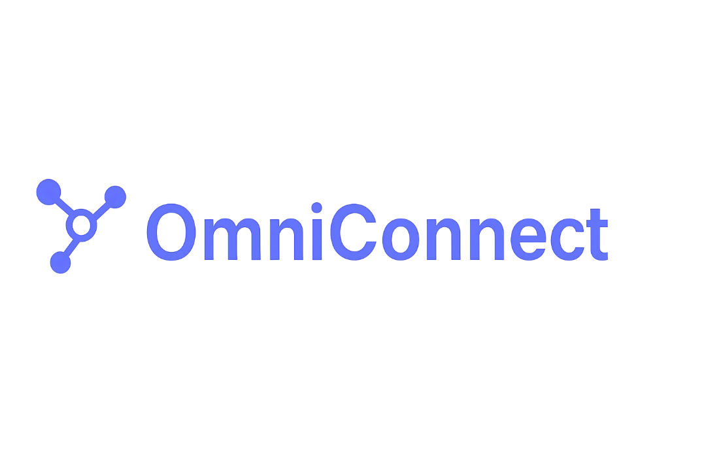
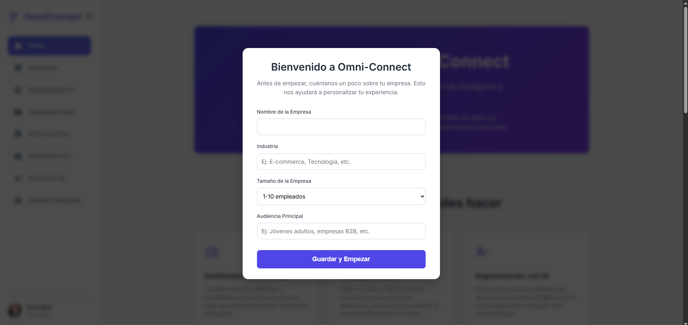
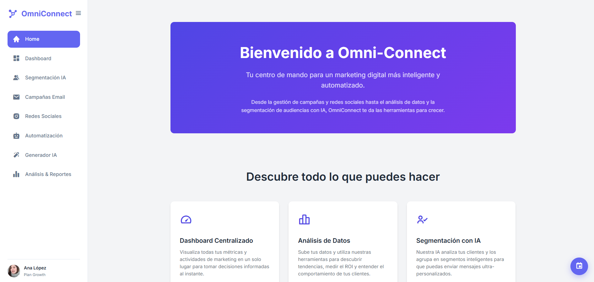
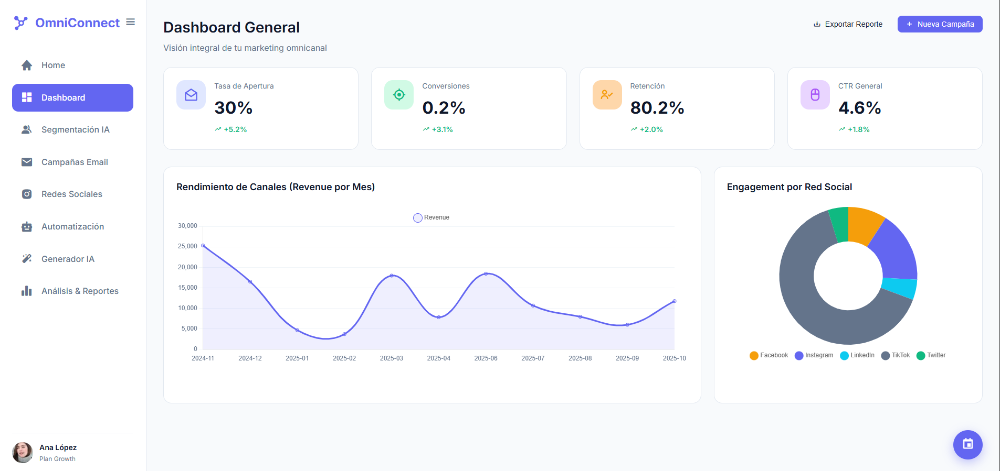
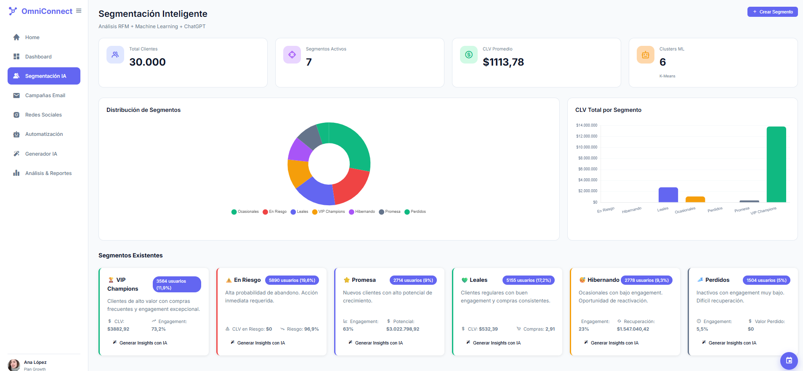
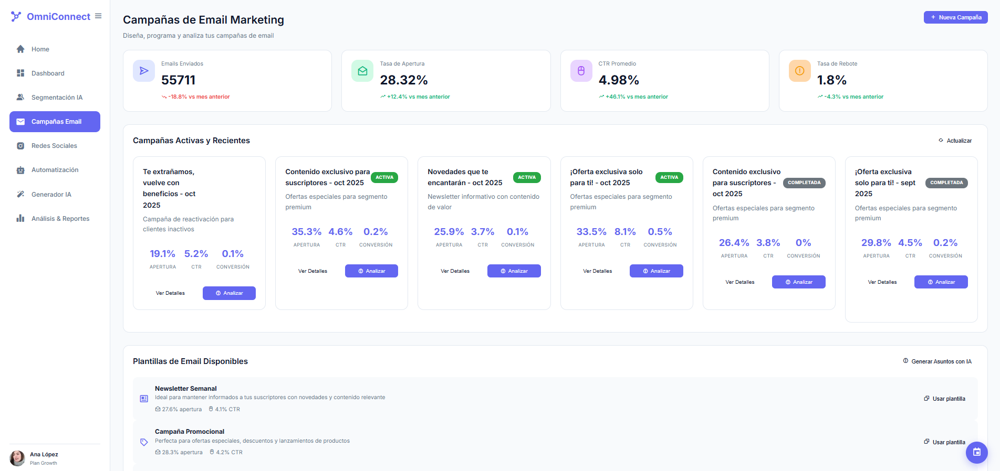
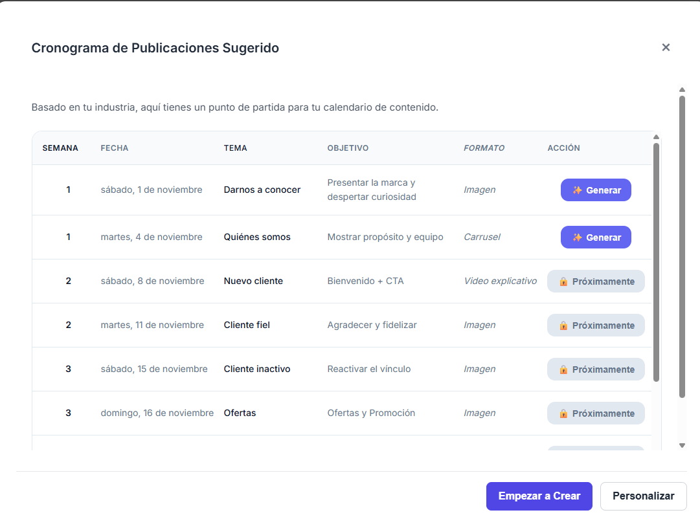
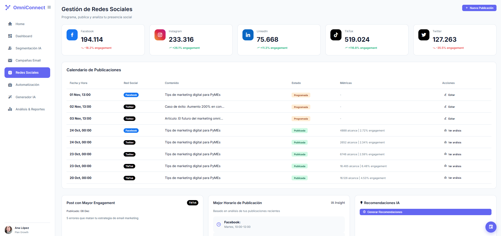
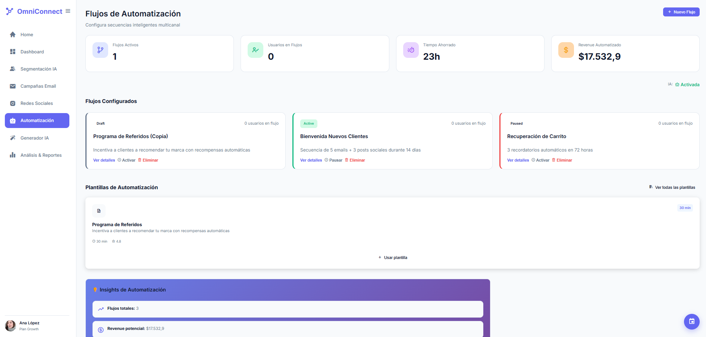
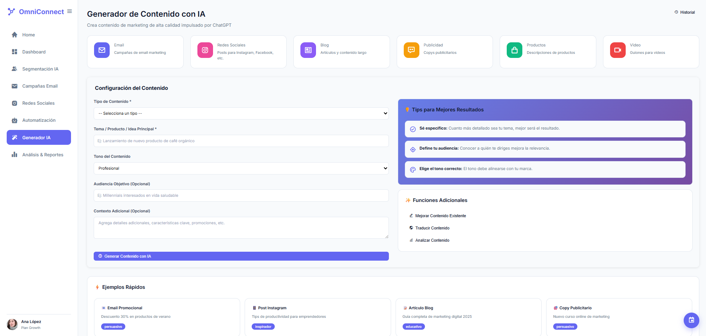

# 🎯 Kit de Marketing Omnicanal para Captación y Retención  

<p align="center"></p>

## 📌 Introducción  

En el mundo digital actual, las empresas compiten por una atención fragmentada: los consumidores saltan entre redes sociales, correos, blogs y múltiples pantallas.  
El **Kit de Marketing Omnicanal** nace para resolver este reto: una solución integral que combina **estrategia, automatización e inteligencia artificial** para que las marcas capten y retengan clientes en distintos canales sin perder coherencia ni cercanía.  

Más que una herramienta, es una **brújula de comunicación** que organiza, automatiza y potencia resultados.  

---

## 👥 Integrantes  

<div align="left">

<table>
  <thead>
    <tr>
      <th>Integrante</th>
      <th>Rol</th>
    </tr>
  </thead>
  <tbody>
    <tr>
      <td><b>Belen Leiva</b></td>
      <td>Marketing Specialist</td>
    </tr>
    <tr>
      <td><b>Silvana Motta</b></td>
      <td>Community Manager</td>
    </tr>
    <tr>
      <td><b>Hernan Butler</b></td>
      <td>Product Manager</td>
    </tr>
    <tr>
      <td><b>José Ardiles Ugaz</b></td>
      <td> Data Scientist</td>
    </tr>
  </tbody>
</table>

</div>

---

## 🎯 Objetivo General  

Diseñar, desarrollar e implementar un **kit digital de marketing omnicanal** enfocado en la **captación y retención de clientes**, que combine **automatización, segmentación inteligente, análisis y generación asistida por IA**.  

---

## 📈 Objetivos Específicos  

- Desarrollar un sistema modular para segmentar audiencias según comportamiento y demografía.  
- Implementar automatización de campañas (email, redes sociales, SMS).  
- Crear un **dashboards** con métricas clave (conversiones, engagement, retención).  
- Integrar funciones de **IA generativa** para la creación de contenido.  
- Diseñar plantillas y materiales listos para implementar.  

---


## ⚙️ Funcionalidades  

- Segmentación avanzada.  
- Automatización de marketing multicanal (email, redes, SMS).  
- Dashboard de métricas (CTR, conversiones, tiempo de interacción).  
- Copys generados por IA adaptados a cada buyer persona.  
- Predicción de valor de vida del cliente (CLV).  
---

## 🧠 Estructura del Kit  

OmniConnect elimina la fragmentación de herramientas al consolidar todo tu marketing digital en una sola plataforma. A continuación, te presentamos cada módulo del sistema:
🏠 Onboarding y Home
<p align="center">
  
  
</p>
<p align="center"></p>
El proceso de incorporación te guía paso a paso. Primero, registras tu empresa indicando su nombre, sector y audiencia principal. Esta información personaliza las sugerencias y adapta la experiencia dentro de la plataforma.
Luego, eliges cómo empezar: puedes trabajar con tus propios datos o generar contenido desde cero. El Home te da la bienvenida y te muestra las capacidades principales del sistema: Dashboard centralizado, análisis de datos y segmentación con IA.
📊 Dashboard General
<p align="center"></p>
El Dashboard General es tu centro de operaciones. Aquí visualizas en tiempo real las métricas más importantes de tu estrategia omnicanal:

Tasa de Apertura : Mide cuántas personas abren tus emails
Conversiones : Rastrea el porcentaje de usuarios que completan acciones deseadas
Retención : Monitorea la fidelidad de tus clientes
CTR General : Analiza la efectividad de tus llamados a la acción

Incluye gráficos interactivos que muestran el rendimiento de canales por mes y la distribución del engagement por red social (Facebook, Instagram, LinkedIn, TikTok, Twitter). Todo consolidado en una vista para tomar decisiones informadas al instante.
🎯 Segmentación Inteligente con IA
<p align="center"></p>
La Segmentación Inteligente utiliza Machine Learning y análisis RFM para dividir automáticamente a tus clientes en grupos estratégicos:

VIP Champions: Clientes de alto valor con compras frecuentes 
En Riesgo: Alta probabilidad de abandono, requieren acción inmediata 
Promesa: Nuevos clientes con alto potencial de crecimiento 
Leales: Compradores regulares con buen engagement 
Hibernando: Bajo engagement, oportunidad de reactivación 
Perdidos: Inactivos con engagement muy bajo 

Cada segmento incluye métricas detalladas (CLV, engagement, riesgo) y la posibilidad de generar insights automáticos con IA para entender mejor su comportamiento y recibir recomendaciones personalizadas.
📧 Campañas de Email Marketing
<p align="center"></p>
El módulo de Campañas Email te permite diseñar, programar y analizar tus estrategias de correo electrónico:

Métricas clave:  emails enviados,  tasa de apertura,  CTR promedio,  tasa de rebote
Vista de campañas activas y completadas: Monitorea el rendimiento individual de cada campaña
Plantillas predefinidas: Newsletter Semanal  y Campaña Promocional 
Generación de asuntos con IA: Crea líneas de asunto optimizadas automáticamente

Todas las campañas muestran métricas de apertura, CTR y conversión, permitiéndote identificar rápidamente qué estrategias funcionan mejor.
📱 Gestión de Redes Sociales
<p align="center">
</p>
El módulo de Redes Sociales centraliza toda tu presencia digital:

Métricas por plataforma: Facebook, Instagram, LinkedIn, TikTok, Twitter
Calendario de publicaciones: Programa contenido con fechas, horarios y estado de cada post
Cronograma sugerido por IA: Obtén un calendario automatizado basado en tu industria con temas, objetivos y formatos óptimos
Mejores horarios: Identifica cuándo tu audiencia está más activa
Posts con mayor engagement: Analiza qué contenido resuena mejor con tu audiencia

Cada publicación se puede generar con un solo clic, incluyendo imagen y copy personalizado.
🤖 Automatización Inteligente
<p align="center"></p>
El módulo de Automatización te permite crear flujos multicanal que trabajan por ti las 24/7:

1 flujo activo que ha ahorrado 23 horas y generado $17,532.9 en revenue automatizado
Flujos configurados:

Bienvenida Nuevos Clientes: Secuencia de 5 emails + 3 posts sociales durante 14 días
Programa de Referidos: Incentiva a clientes a recomendar tu marca con recompensas automáticas
Recuperación de Carrito: 3 recordatorios automáticos en 72 horas


Plantillas de automatización: 30 minutos promedio de configuración, métricas de efectividad (4.8/5)
Revenue potencial calculado: $17,532.9 proyectado

Los flujos se pueden activar, pausar o eliminar con un clic, y cada uno muestra el número de usuarios activos en tiempo real.
✨ Generador de Contenido con IA
<p align="center"></p>
El Generador IA crea contenido de marketing profesional en segundos, potenciado por ChatGPT:
Tipos de contenido disponibles:

📧 Email: Campañas de email marketing
📱 Redes Sociales: Posts para Instagram, Facebook, etc.
📝 Blog: Artículos y contenido largo
💬 Publicidad: Copys publicitarios
🛍️ Productos: Descripciones de productos
🎬 Video: Guiones para videos

Funciones adicionales:

✏️ Mejorar contenido existente
🌍 Traducir contenido
📊 Analizar contenido

El sistema incluye tips inteligentes (Sé específico, Define tu audiencia, Elige el tono correcto) y ejemplos rápidos para cada formato. Solo completas un formulario simple y obtienes contenido listo para usar o personalizar.
📈 Análisis y Reportes
<p align="center"></p>
El módulo de Análisis y Reportes te ofrece insights detallados de todas tus campañas:

Métricas consolidadas: conversiones totales,  tasa de apertura, CTR promedio,  ROI
Evolución temporal: Gráfico interactivo que muestra conversiones, clics y aperturas a lo largo del tiempo
Top campañas del período: Analiza qué campañas generan mejores resultados (revenue, CTR, conversión)
Insights generados por IA: Obtén análisis automáticos y recomendaciones estratégicas
Exportación múltiple: Descarga datos en CSV, Excel o genera reportes completos en PDF

El tooltip interactivo en el gráfico te permite ver métricas específicas de cualquier día (ej: 2025-10-13 con 70 conversiones, 11 clics, 9 aperturas).

---


## 🛠️ Tecnologías Utilizadas  

### Lenguajes y Frameworks:


### Inteligencia Artificial y Datos:


### Gestión del Proyecto:


---

## 🚀 Cómo Ejecutar el Proyecto

Para poner en marcha el Kit de Marketing Omnicanal, necesitas ejecutar el backend (servidor) y la aplicación web (cliente) por separado.

### 1. Ejecutar el Backend (Servidor)

El backend está construido con Python y FastAPI.

1.  **Abre una terminal** en la raíz del proyecto.
2.  **Asegúrate de tener Python instalado** (versión 3.8 o superior).
3.  **Ejecuta el siguiente comando** para instalar las dependencias y arrancar el servidor:

    ```bash
    .\run_backend.bat
    ```

    *Este comando instalará todas las librerías necesarias desde `requirements.txt` y dejará el servidor corriendo en `http://localhost:8000`.*

### 2. Ejecutar la Aplicación Web (Cliente)

La aplicación web principal se sirve desde la carpeta `WEBAPP`.

1.  **Abre una nueva terminal** en la raíz del proyecto.
2.  **Ejecuta el siguiente comando** para iniciar el servidor web y abrir la aplicación en tu navegador:

    ```bash
    .\run_webapp.bat
    ```

    *Este comando utilizará Python para servir los archivos de la aplicación en `http://localhost:5500` y la abrirá automáticamente.*

### Alternativa: Ejecutar la aplicación con React (`my-app`)

---


## 🔗 Enlaces  

- [Video Youtube](https://youtu.be/pKeINeUtNvE)  

---

## 📄 Licencia  

Este proyecto está licenciado bajo la **Licencia MIT** – ver archivo [LICENSE](LICENSE.txt) para más detalles.  
